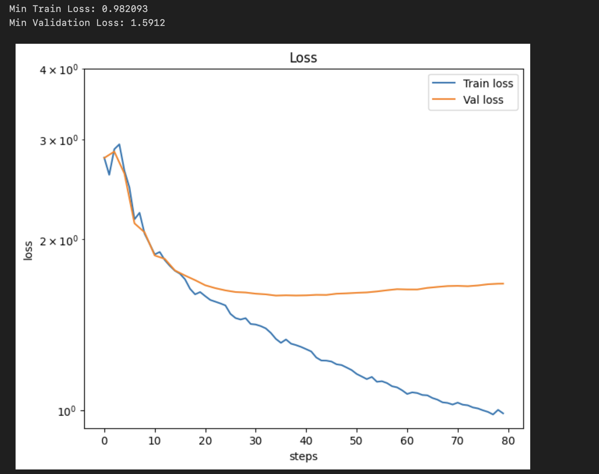

# MiniLlama Instruct

Instruction Tuning [MiniLlama](https://github.com/sainadh-d/mini-llama) (109M) using [Alpaca Dataset](https://huggingface.co/datasets/tatsu-lab/alpaca).

## Intention
Tune the MiniLlama (109M) base model on the [Alpaca Dataset](https://huggingface.co/datasets/tatsu-lab/alpaca), to follow instructions. This is continuation of training [MiniLlama](https://github.com/sainadh-d/mini-llama) and [Instruct Tuning GPT2](https://github.com/sainadh-d/gpt2-instruct)

## Process
1. Get the alpaca dataset.
2. Preprocess the dataset with "Instruction, Input, Output" template mentioned below and add `BOS` and `EOS` special tokens for every example.
3. Load the pre-trained Llama model using weights from [MiniLlama](https://github.com/sainadh-d/mini-llama)
4. Run training for 10 epochs. (10 was chosen randomly. From the results it looks like validation-loss flattened after 40 steps.)
5. Evaluate the results

### Pre Processing Template

```
### Instruction:

### Input:

### Output:
```

## Results

- Min Train Loss: 0.982093
- Min Validation Loss: 1.5912



## Sample Generation

While the base model keeps blabbering continuously, the instruction-tuned model gives coherent answers.

```
Enter a prompt: What is 2 + 2?
2 + 2 is 4.

Enter a prompt: Where is Eiffel Tower?
Eiffel Tower is located in Paris, France.

Enter a prompt: Who is the president of U.S?
Joe Biden is the president of the United States.
```

more can be found in [infer.ipynb](infer.ipynb)

## TODO

- [ ] The current processing template (`### Instruction ...`) wastes lots of tokens. Instead use special tokens
- [ ] Pad the examples with pad_token and train instead of packing them all together
- [ ] Train on more instructions
- [ ] Evaluate on any benchmark


